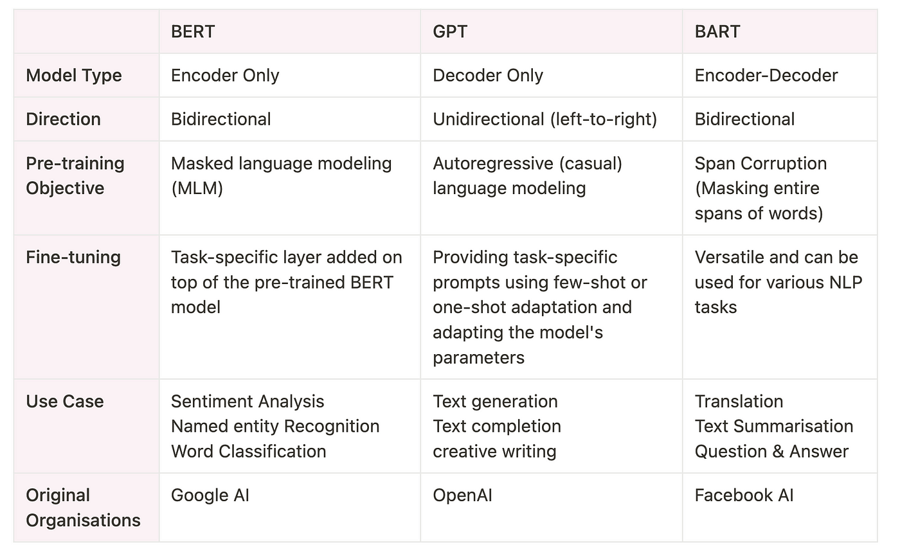

# Differences Between GPT and BERT
Updated by Sep, 2024
 
**- GPT: Generative Pre-trained Transformer**

**- BERT: Bidirectional Encoder Representations from Transformers**

While both leverage the transformer architecture, they are fundamentally different in design and application.

## Overview of Transformer Architecture
Before discussing the differences, it is essential to understand the base architecture that both models build upon: the transformer. Introduced in the paper "Attention is All You Need" by Vaswani et al. in 2017, the transformer model relies heavily on the self-attention mechanism to process data in parallel and capture complex word relationships at different positions in the input sequence. This architecture has enabled more efficient training and superior handling of long-range dependencies compared to previous models based on recurrent neural networks (RNNs) and convolutional neural networks (CNNs).

## GPT: Generative Pre-trained Transformer
GPT, developed by **OpenAI**, is designed as an autoregressive model that predicts the next word in a sentence given all the previous words. It is fundamentally generative, which means it can generate coherent and contextually relevant text based on the input it receives.

Here are some key features of GPT:

**Autoregressive Nature**: GPT is trained to predict the next word sequentially, making it highly effective for tasks that involve generating text, like content creation, story generation, and language translation.
**Unidirectional Context**: GPT only considers the previous words in the input for predictions, not what follows. This unidirectional approach is simpler but limits its effectiveness in understanding the full context of the input.
**Fine-tuning on Task-Specific Datasets**: After pre-training on a large corpus of text, GPT can be fine-tuned for specific tasks by training further on task-specific datasets.

## BERT: Bidirectional Encoder Representations from Transformers
BERT, developed by researchers at **Google**, contrasts with GPT in that it is designed to derive deep bidirectional context from text by processing words in relation to all the other words in a sentence (rather than just the words that precede them). Here are the hallmarks of BERT:

**Bidirectional Context**: BERT’s major innovation is its mechanism of **"masked language modeling" (MLM)**, where some words are randomly masked, and the objective is to predict these masked words based on both left and right context, thus providing a deeper understanding of language structure and usage.
**Non-Generative**: Unlike GPT, BERT is not used for generating text but for tasks that require understanding the relationships and representations within text, such as sentiment analysis, question answering, and language inference.
**Fine-tuning for Downstream Tasks**: Similar to GPT, BERT is also fine-tuned from its pre-trained state on specific NLP tasks, though it generally requires fewer epochs of training due to its robust initial understanding of language context.

## BERT vs GPT vs BART
